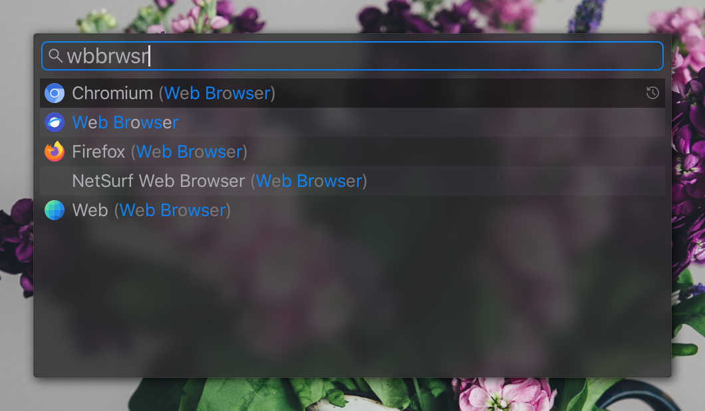

# Launcher

A Linux application launcher.



## Building

To build and install:

```sh
$ make && sudo make install
```

The makefile will build the program using `cargo build` and create the history
file and set its permissions.

Debug builds:

```sh
# Just build it:
$ cargo build
# Or to run it as well:
$ cargo run
```

Note that debug builds do not set the `override_redirect` flag on the window so they will appear as normal windows,
this is required for me to test it using X forwarding on Windows.

### Dependencies

- `libX11`
- `libXinerama`

- `xclip` is used for copying text from smart content

## Functionality

The program searches for programs similar to the search text in both [Freedesktop Desktop Entries](https://wiki.archlinux.org/title/desktop_entries) and executables in the `PATH` environment variable.

Desktop entries are searched for the localized name, normal name, localized generic name, generic name, and the name of the desktop file.

All these ways of matching have a different priority which will give a slight boost to their score and resulting order in the results list (higher boost at the top):

- Localized name
- Localized generic name
- Normal name
- Generic name
- Name of executable in `PATH`
- Name of `.desktop` file

Additionally entries that are in the history gain a large priority bonus.

The locale used for localized name is either extracted from `LC_MESSAGES` (or `LANG` if not set) or the `locale` value in the configuration.
To disable localized names just set the `locale` value in the config to an empty string or some other invalid value.

## Smart Content

The program can do some basic operations based on the input text:

- Evaluate arithmetic expressions, this happens automatically but if the prompt starts with `=` it will be forced, showing errors in the input
    - Operators: `+`, `-`, `*`, `/`, `^`, `%`
    - Functions: `sqrt`, `sin`, `cos`, `tan`, `floor`, `ceil`, and more, see [here](https://docs.rs/meval/latest/meval/#supported-expressions)
    - Constants: `pi`, `e`
- Convert units, supporting all kinds of units for distance, mass, area, volume, temperature, speed, and currencies that are updated from the internet once per day.
    Formats recognized as requesting conversion are (number and unit can be separated):
    - `123from`
    - `123from to`
    - `123from "to" to`
    - `123from "in" to` (Note: `123cm in` matches the 2nd variant with inches, `123cm in feet` matches this)
    - `123from "as" to`

    Units can be written in their short and long form, singular and plural, for example `in`, `inch`, `inches`, `cm`, `centimeter`, `centimeters`.
    Speeds are given by `<distance>/<h/m/s>`, `kph`, or `mph`.
    Feet and inches can be given as `f'i"`.
- Open a file or directory, there are no suggestions, program for opening is chosen by `xdg-open`
- Open a URL, this also uses `xdg-open`
- Run a command, if the input starts with a `$` everything after it will be ran in a bash shell

## Controls

Initially the text entry box is focused, this supports most common text editing
controls (cursor movement, selection when holding shift, ctrl+left/right to jump words, home/end to jump to the begin or end).

Pressing the down arrow once while the input if focused changes the focus to the list view, in here the cursor can be moved using the up/down arrows, home, and end. Pressing the up arrow when the first item is selected changes focus back to the input box.

Additionally pressing tab always swap the input focus.

In the list view, pressing Enter will launch the selected program.

If the input text is empty all the items in the history are displayed, in this mode pressing
delete will remove the selected item from the history.

Clicking and item selects it and double-clicking it launches the program.

## Configuration

The configuration is a TOML file located at `~/.config/launcher.toml` with the following values:

```toml
# Dimensions of the window in percentage of the main monitor size.
window_width_percent = 50
window_height_percent = 50

# Height of the text entry box in pixels.
entry_height = 48

# Height of each item in the results list in pixels, the height of the window
# will be adjusted so that the results list height is a multiple of this value.
list_item_height = 44

# Width of the scroll bar for the results list, or 0 to disable it
scroll_bar_width = 8

# Font for the text entry
entry_font = "sans 24"

# Font for the results list
list_font = "sans 20"

# Font the "No results" banner if there are no search results, this will be
# centered inside the list view.
list_empty_font = "sans 48"

# Font for the smart content display.  The height will be the smallest multiple
# of the list item height that is greater than the font height.
smart_content_font = "sans 32"

# The locale to use for localized keys, this has no default value as the current
# locale is used if not specified. Note that a lot of keys only use the LANG
# part of the locale so you can for example use "ko" instead of "ko_KR.UTF8".
locale = "no default value"

# The icon theme, this sould be the name of a folder in one of the following
# locations, containing a "48x48" folder:
#  - /usr/share/icons/
#  - ~/.local/share/icons/
#  - ~/.icons/
icon_theme = "Papirus"

# Mouse scroll speed for the results list.
scroll_speed = 10

# Number of items to keep in the history
history_entries = 100

# The default currency, this is what any other currency is converted to if no
# explicity conversion is given.
default_currency = <read from LC_MONETARY>

# What URLs to allow opening with smart content. `http` only allows opening
# URLs starting with http (and therefore https).
smart_content_urls = "none"|"http"|"all"

# Allow conversions of dynamic units with smart content.  These are units that
# need to be fetched from the internet.
smart_content_dynamic_conversions = true
```

The values specified here are the default values used if not defined.

## Icons

All icons in the `res` directory are from [Google Fonts](https://fonts.google.com/icons).
